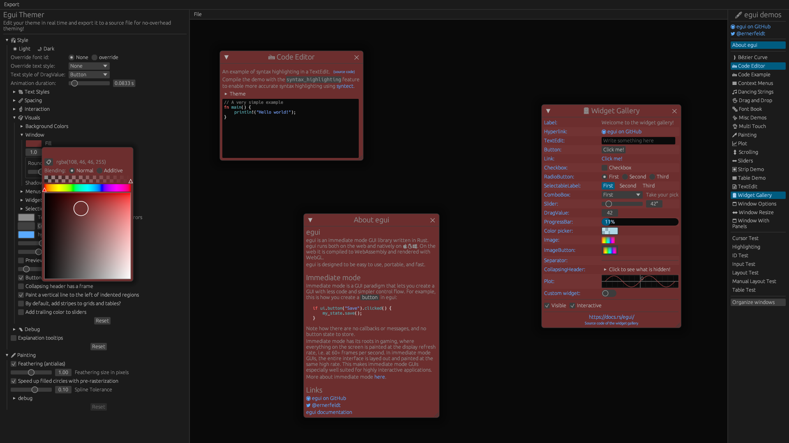

# egui-themer

Create an [`egui`](https://github.com/emilk/egui) theme while previewing the live demo, then export it to JSON or native Rust source code.

[View Live](https://grantshandy.github.io/egui-themer)

*my theming skills aren't great :)*
